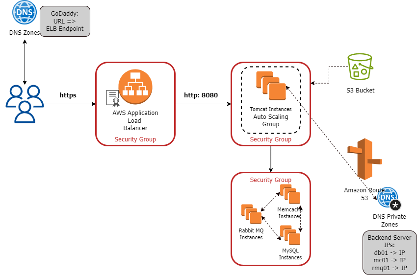

## Deploying VProfile App on AWS Cloud: Lift & Shift Strategy

### About the Project

* Multi-tier web application stack: *VProfile*

* Host and run on AWS cloud for production

* Lift & Shift strategy is used

### AWS Services used

* EC2 instances: VMs used for Tomcat, RabbitMQ, Memcache, MySQL servers

* ELB (Load Balancer): Replacement for the NGinx LB server

* Autoscaling: Automation for VM scaling

* S3/EFS storage: Shared storage

* Route 53: Private DNS service

### Architecture of AWS services

The AWS sources we will be using in the project are:

* Amazon Certificate Manager: Used for https certificate

* Application Load Balancer

* Set of EC2 instances: for Tomcat, Memcache, Rabbit MQ and MySQL

* Security groups: 3

* Amazon Route 53 for DNS Private Zones

* Amazon S3 bucket to store software artifacts

### Flow of Execution

1. Get into AWS Account

2. Create Key Pairs for our instances

3. Create Security Groups for LB, Tomcat and backend services

4. Launch instances with user data: bash scripts

5. Update IP to name mapping in route 53

6. Build application from source code

7. Upload to S3 bucket

8. Download artifact to Tomcat EC2 instance

9. Setup ELB with HTTPS (Certificate from Amazon Certificate Manager)

10. Map ELB endpoint to website name in GoDaddy's DNS

11. Verify

12. Build Auto Scaling Group for Tomcat instances
