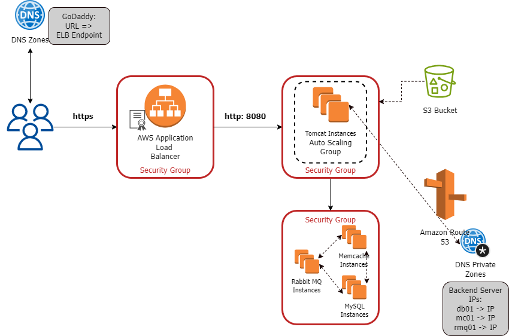

## VProfile Web Application on AWS

### About VProfile

VProfile is a multi-tier web application written in Java by [hkhcoder](https://github.com/hkhcoder/vprofile-project.git). 

The architecture of the project services is shown below:

#### About the Project

* Host and run the application on AWS cloud for production

* Deployment strategies:

  - Lift & Shift:
 
### AWS Services

* EC2 instances: VMs used for Tomcat, RabbitMQ, Memcache, MySQL servers

* ELB (Load Balancer): Replacement for the NGinx LB server

* Autoscaling: Automation for VM scaling

* S3/EFS storage: Shared storage

* Route 53: Private DNS service

### Architecture of AWS services

The AWS services used in the project:

* Application Load Balancer

* Set of EC2 instances: for Tomcat, Memcache, Rabbit MQ and MySQL

* EC2 security groups

* Amazon S3 bucket to store software artifacts

* DNS Private Zones and Amazon Certificate Manager were NOT included this time

